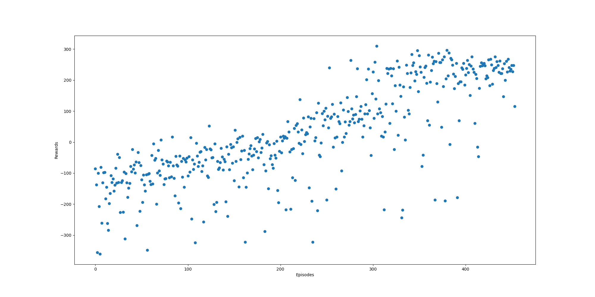

# Deep Reinforcement Learning for Lunar Landing

Final project for EE460J Data Science Lab
By Niruti Dhoble, Jianchen Gu, Indhu Gunda, Shreyas Kudari, Isaac Lee, Sophia Xu, and Kory Yang

## Introduction 
Deep Reinforcement learning is an exciting branch of AI that closely mimics the way human intelligence explores and learns in an environment. In our project, we dive into deep RL and explore ways to solve OpenAI Gym’s Lunar Lander v2 problem with Deep Q-Learning variants and a Policy Gradient. We also tested the robustness of successful models to real-world scenarios by introducing sensor noise, engine failures, and turbulence to the original environment. Finally, we attempt quantized reinforcement learning to improve speed and memory efficiency.

## Environment
Lunar Lander is a game where one maneuvers a moon lander to attempt to carefully land it on a landing pad. OpenAI Gym provides a Lunar Lander environment that is designed to interface with reinforcement learning agents. The environment handles the backend tasks of simulation, physics, rewards, and game control which allows one to solely focus on building an agent. The state information of the environment is presented with an 8-dimensional vector containing continuous values for variables, including the lander’s coordinates, orientation, velocities, and ground contact indicators. The action space is 4-dimensional with options to do nothing, fire left engine, fire right engine, or fire main engine. The reward structure is as follows:
* +100/-100 for coming to rest or crashing.
* Ground contact for each leg is +10
* Firing engine is -0.3
The benchmark for winning the game is 200 points.

An example of the game in action is shown below:

The above landing would have earned +100 points for coming to rest with ground contact for both legs.

The above episode would have earned -100 points for crashing.

## Background
### Deep Q - Learning
Reinforcement Learning problems can be framed as Markov Decision Processes (MDPs). The basic idea is to learn to take the right actions for the states the agent encounters. One straightforward approach to learn these state-action pairs is Q-learning. Q-learning maintains a Q-table that is iteratively updated in order to maximize the reward for every state it encounters. This strategy is captured by the Bellman Equation:

The optimal action-state value is the current reward and the discounted maximum future reward possible. In the case of finite discrete input spaces, the number of Q values to compute would be finite and can be solved iteratively in a dynamic programming styled approach:

However, when the state representation is continuous, as is in our case, maintaining a Q-table would need infinite space. This is where Neural networks come in as function approximators to estimate the action-value function:

The neural network is trained by minimizing the Mean-Squared Error (MSE) loss for the function:

where 

This way, throughout multiple iterations, the Q-network is smoothened and an optimal Q-function is learned. 
The following are a few common concepts employed across our DQN agents. 

### Epsilon-Greedy Exploration Strategy
For our exploration in DQNs, we employ the epsilon-greedy strategy with epsilon decay. This strategy dictates that a random action is taken with probability epsilon, and a network based action is taken otherwise. The value of epsilon decays over time to reduce exploration and rely more on the learned Q-network.

### Experience Replay - Batch Learning
In a reinforcement learning environment, sequential states are strongly correlated. This is especially true for the lander. The actions the lander would take at one moment is strongly correlated to the actions it takes in the near future and past. Therefore, it is more efficient to train the network in batches sampled uniformly from a memory of experiences containing state-action-reward-next-state tuples. Moreover, online Q-learning runs the risk of near-sightedness which could get stuck in a local minimum.

insert network architecture picture here

## Models
### Vanilla DQN (Standard DQN)
Vanilla DQN is our baseline model that utilizes the above network to learn the state Q-values. We compute the loss and update the weights every 5 iterations with a batch size of 32. Our future value discount rate, gamma, is 0.99. The learning results are as follows:

  
The 200 average score threshold is reached at around 660 episodes. The model has learned the environment successfully as demonstrated by its ability to land and turn off the engine in the video below:

### Double DQN
After implementing the DQN, we moved on to trying the Double DQN model. For background, a popular problem of the previous algorithm of DQN models is the overestimation of the action value, or Q-value. Instead, the algorithm of Double Q-Learning solves the problem of overestimating the action value, or the Q-value. This algorithm utilizes two action-value functions as estimators. The main difference between the Vanilla DQN and the Double DQN is the target equation, which is as follows:

We follow [this algorithm](insert link)

When applied to Lunar Lander it performed very well and had significant advantages over Vanilla DQN. As can be seen in the plots below, there were fewer outliers than for Vanilla DQN making the Double DQN’s more robust. In addition, the 200 average score threshold is reached at around 425 episodes which is faster than with the Vanilla DQN.

graphs

### Dueling DQN
The Dueling DQN is an alternative variation of the standard vanilla DQN utilizing a novel dueling architecture. This structure utilizes two separate streams to explicitly separate the representation of state values and state-dependent action advantages.The two streams represent the value and advantage functions, and share a common convolutional feature learning module (Wang et al.).

The advantage of the Dueling DQN is its ability to learn the value of the states without the need to learn the effect of each action for each of these states. The main application for this is in scenarios where the states’ actions do not affect the environment in any way. This is applicable to Lunar Lander, as in many states the choice of action for the moon lander (its movement or trajectory) does not matter for the environment

The key part of the architecture, the aggregating module (for the two streams), implements the forward mapping:

where V is the state value and A is the advantage.

When applied to Lunar Lander, the Dueling DQN performed rather phenomenally. As seen in the scatter and stem plots below, an average score of greater than 200 was achieved in just less than 500 episodes. The fast convergence was accompanied by a more robustness; there is a significant decrease in performance outliers when compared to the plots of the standard Vanilla DQN.

### Prioritized Experience Replay
Prioritized Experience Replay, though another variation of the standard DQN, implements a completely different approach that that of the Dueling DQN. Normally, all experiences are equally weighted and thus uniformly sampled. Prioritized Experience Replay aims to prioritize certain experiences to improve the learning process and replay important transitions more frequently (Schaul et al.).

The sampling probability will be proportional to the loss obtained after the forward pass of the network, meaning that experiences that resulted in larger amounts of learning should be prioritized. Each experience is associated with its respective probability, priority, and weight. The probability of sampling experience i is defined by the equation:

where pi is the priority of the experience i, and 𝛼 determines the degree of prioritization. (𝛼 = 0 if uniform). Meanwhile, the weight of experience i is defined by the equation:

where N is the total number of experiences and 𝛽 is used for the purposes of annealing the amount of importance-sampling correction over time, linearly arriving at 1 by the end of the learning.

In the context of Lunar Lander, Prioritized Experience Replay was implemented on top of the Dueling DQN architecture yet did not perform as well as even the standard Vanilla DQN. Various combinations of 𝛼 and 𝛽 were used, starting from the baseline 𝛼 = 0.4 and 𝛽 = 0.6. The best performance recorded was at 𝛼 = 0.6 and 𝛽 = 0.95, with the best 100 episode average score of 190.04, recorded with the following code and plot:

The model was able to stabilize by approximately episode 800, but continuously oscillated and never broke a 100-episode average of greater than 200, even by the hard 1000 episode limit. The graphs also show some pretty volatile behavior, with a good number of sudden, drastic drops in performance even near the end.

However, there are multiple justifications for this seemingly strange behavior. For one, the research publication on Prioritized Experience Replay observed a large variation in outcome across multiple environments, and it is possible Lunar Lander in particular may not be suitable for this approach. Lunar Lander is also a rather simple environment presenting a problem that typically takes far less episodes to fully solve than that of many other games.It is possible that Prioritized Experience Replay resulted in significant overfitting through continuous sampling of the same experiences or introduced bias due to the nature of the experiences leading to crashes far more than successful landings. Thus, Prioritized Experience Replay may not be suitable for Lunar Lander.

### Rainbow DQN
Rainbow DQN is a DQN variant that combines improvements of many different variations of DQN into a single model. Building on top of the original DQN, the original paper for Rainbow selected six specific improvements to aggregate into one model (Hessel et al.):
* Double Q-Learning
* Prioritized Experience Replay
* Dueling Networks
* Multi-step learning
* Distributional RL
* Noisy Nets

Double Q-Learning attempts to correct overestimation bias present in the standard DQN - this can be accomplished by modifying the loss used by DQN:

Prioritized experience replay is used to identify important transitions from the replay buffer - typically, DQN samples from the replay buffer uniformly. (see previous section on prioritized experience replay)

Rainbow also uses a dueling network architecture (see section on Dueling DQN). Multi-step learning utilizes a n-step return versus a singular return value at each iteration, as defined below:

Multi step learning, when selecting the correct n, is used to reduce training time.

Distributional reinforcement learning is used to train on the expected distribution of returns rather than the expected value, and noisy nets introduce linear layers of noise into the model for better exploration, in favor of the epsilon-greedy strategy of exploration used in the standard DQN.

The aggregation of all of these models, according to the original paper proposing the Rainbow model, produces “state-of-the-art performance on the Atari 2600 benchmark, both in terms of data efficiency and final performance.” Therefore, it was a prime candidate to use for the Lunar Lander Environment.

When applied to Lunar Lander, however, the training proved to be fairly unstable. When applied to the Lunar Lander environment, the mean reward would not converge to a value of 200 or higher, and in most cases the model would see an initial increase in the mean reward, plateau, and then decrease as time went on (catastrophic forgetting). In the training session below, the mean peaked at around 200-300 episodes, at a reward of around 150 points. One possible reason why Rainbow failed to produce results is due to Rainbow’s incorporation of prioritized experience replay, which also failed to perform well on the lunar lander environment (see previous section on prioritized experience replay).

graphs

### Vanilla Policy Gradient 
Policy Gradient is the second of the two major approaches (other being DQN) to deep reinforcement learning. Although our project mostly focused on DQN and its variants, we wanted to give Policy Gradient a try and see how its vanilla version compares. In contrast to DQNs, which tries to satisfy the Bellman Equation, the Policy Gradient method tries to maximize returns by slowly converging toward its policy gradient.

The Policy Gradient is found as follows. To start, the trajectory (defined as tau) is a sequence of actions and their corresponding rewards:

Next, we need to sum the rewards of the trajectory, which are given a discount rate defined to be 0.99 our model. The discount rate is applied due to higher benefits from applying it to tasks of episodic nature. In our model, we make a slight adjustment in summing the rewards, by only summing the discounted rewards from the time t until the end of the episode instead of from the very beginning. This is known as Rewards-To-Go, which says that actions committed after a time t should not affect rewards obtained prior to time t.

Then, we take a sample mean of the discounted rewards of all the trajectories in a single batch. In our case, we use a batch size of 64, which means running 64 episodes and thus 64 trajectories:

Finally, we define our policy gradient to be optimized as the gradient of our rewards performance:

Lastly, VPG is known as an “on-policy” method. This means that the algorithm chooses to try and find an unbiased sample of its policy gradient, which means that the trajectories must be sampled from the current policy. This differs from “off-policy” methods like DQN, as DQN can also use experiences gained from previous policies.

In our experience running VPG on Lunar Lander, we found that our model was able to reach an average of +200 in rewards (in the past 100 episodes) by the approximately episode 4600. Some basic observations show us that VPG had a lot of variance in the first 1000 episodes, but this variance range slowly decreased in size as episodes continued, where the average rewards were in a much tighter range towards the 3000th episode and beyond. In comparison to DQNs, the most notable difference was the massive difference in episodes needed to train a VPG to reach +200 average rewards. 

Something to note is that since Policy Gradient methods are “on-policy”, they are generally much less sample efficient in comparison to “off-policy”. As mentioned earlier, this means that Policy Gradient is unable to reuse experience in choosing trajectories from prior policies in order to reduce bias. The architecture of VPG itself can justify why VPG takes a significantly higher number of episodes in training to reach average returns of +200 in Lunar Lander.

## Environment Changes and Noise Addition
A creative aspect of this project was how the team changed the environment for lunar landing to incorporate turbulence, sensor noise, and action noise. 

### Turbulence 
Turbulence is also known as wind. When changing the wind through code, primarily it was altering the force function. The original code for lunar landing from Open AI Gym uses multiple types of forces on various aspects of the game. Forces are primarily applied to the main and side engines. The main engine is significantly stronger, since from a realistic point of view, it takes much more force to work against gravity then to move horizontally. 

In order to create some turbulence, a function called ApplyForceToCenter, which was already in the source code was altered and applied to every episode rather than once for the entire game. The ApplyForceToCenter function helps keep the lander in the center of the game at all times, this is why when there is no wind, or external noises, the lunar lander will land in between the poles and fall straight down most of the time. However, once the wind was applied, it was very evident that the lunar lander would move to the right or left significantly more, sometimes even moving offscreen. The amount of force that was applied was: the main engine power/6 and the main engine power/3. These values were chosen based on the paper linked below. The values from their research showed that if the force applied to the environment was too strong then there was no way the models would be able to train on the data. Therefore the best and ideal metrics to use was taking the main engine power and dividing by 3 and 6. 

After creating the wind, four models were tested on this new environment: Vanilla DQN, Double DQN, Dueling DQN, and Policy Gradient since they provided the best results. When training the models, most of them were trained on 500 episodes, since by this point it was evident whether the graph was converging or not. Based on the graphs and results obtained the models did a great job training on this new environment. Furthermore Dueling did the best since it was already starting to converge at episode 300-500, while Vanilla and Double DQN, took a bit longer to get to the point of convergence.

These are the graphs for each type of Engine Power:

**Main Engine Power /3:** The Vanilla DQN, and Double DQN were around 0 rewards for the 500 episodes, however Dueling DQN was much better with more positive range rewards as can be seen from the three graphs:

* Vanilla: Vanilla required 1000 episodes in order for the convergence to be seen, thus out of all the graphs, Vanilla DQN has 1000 episodes

* Double DQN:

* Dueling DQN:

Furthermore we also tried Vanilla Policy Gradient and interestingly enough the policy gradient was similar to the Vanilla DQN out of the other three models. Both the Policy Gradient and the Vanilla DQN had results near 0. 

* Policy Gradient:

**Main Engine Power /6:** For this type of power the results were similar to the Main Engine Power /3 graphs. Vanilla DQN and Double DQN models produced graphs that were around 0, or in the negative range. However the Dueling DQN model produced rewards that were more positive as can be seen from the following graphs:

* Vanilla DQN: Vanilla required 1000 episodes in order for the convergence to be seen, thus out of all the graphs, Vanilla DQN has 1000 episodes

* Double DQN:

* Dueling DQN:

The Policy Gradient model was also tested and compared to the other three models tested for this specific Wind power, the Policy Gradient produced a result that converged at the value 0 and did not have many positive rewards. This result was similar to the Wind power = main engine power /3.

* Policy Gradient:

As stated earlier, if the power is too large, then it would be difficult for the training to occur on these models. To better emphasize the difficulty in obtaining a positive reward, the Vanilla DQN model was trained on an environment that had a wind force of the main engineer * 3. When graphed episodes vs rewards, rarely produced a reward value of 0 or higher. The rewards were primarily negativity, thus explaining that too much power wont allow for proper training to occur. 
The following graph is for the Vanilla DQN where the wind power = main engine power *3:

Overall the models ranked as the following in producing positive rewards: Dueling DQN, Double DQN, Vanilla Policy Gradient/ Vanilla DQN. Notice that the models trained without noise are averaging around 0 for all the three DQN variants.However Vanilla DQN actually did worse when the wind turbulence was introduced. This shows that Vanilla DQN had a difficult time training in a windy environment.  This means that the agents are not learning off the correct Q-values. In Dueling and Double models, the amount of rewards are increasing as the episode count increases. Thus these two models are doing better than the Vanilla DQN. A possible reason why this occurred is that Dueling was better than Double is because it was  able to separate the action and state values, which allowed the model to learn effectively in windy environments. Furthermore, The dueling architecture is also relatively robust to noise, which may reflect the wind,  due to its separate advantage stream as opposed to other single stream networks

Vanilla Policy Gradient which is different from DQN learning algorithms, did surprisingly bad. A possible reason why this might have occurred is that the policy gradient only goes off the current episode which may be why it was not able to adapt to the windy environments, because it wasn’t able to see a pattern in the wind. Thus requiring more episodes in order for the convergence to be seen.

### Sensor Noise
In a real-world setting, sensor readings are noisy. We wanted to test how our best collection of models perform with sensor noise. We introduced noise to the x coordinate, y coordinate, and orientation variables in the state vector returned after every step in the environment. The noise is represented by a zero mean Gaussian distribution. Low noise level is sampled from the distribution with a standard deviation of 0.05. High noise is tested with a standard deviation of 0.5. To test the robustness, we used two agents each for our sample DQN variants, one trained in an ideal setting with no sensor noise, and the other trained in a noisy environment. 

#### Training in a noisy environment
Our Vanilla and Duelling DQNs were not able to reach an average 200 score in training but were close enough at around 185. It appears that the average was brought down by the greater magnitude losses. This means that mistakes cost greater and the variance of rewards is much larger with noise. 

##### Dueling DQN training with sensor noise ~ N(u=0,sigma = 0.05):

##### Dueling DQN training with sensor noise ~ N(u=0,sigma = 0.5):

Our Double DQN agent was able to cross the 200 point benchmark for zero-mean noise with sigma = 0.05 within 650 episodes. The Double DQN appears to be more stable with less variance in reward results and therefore fewer losses which don’t pull the average down. This may be because of the more stable nature of the target Q-values during training since it is updated in periods. This is letting the model to generalize the state-action values much better than other models that have constantly moving target Q-values during updates.

##### Double DQN training with sensor noise ~ N(u=0, sigma = 0.05):

However, with a noise standard deviation of 0.5, Double failed to average the benchmark score and demonstrates the highest variance in rewards. 

##### Double DQN training with sensor noise ~ N(u=0, sigma = 0.5):

Our Vanilla Policy Gradient agent was able to cross the 200 point benchmark for zero-mean noise with sigma = 0.05 at roughly 5200 episodes. In comparison to the DQN agents, VPG required nearly ten times the number of episodes to reach our reward benchmark. This can be attributed to VPG’s architecture, since “on-policy” methods learn from its trajectory (action and rewards) on its current policy gradient, rather than learning from different actions in the case of DQNs. VPG also appears to reduce its variance more on its path to convergence in comparison to DQNs. This suggests that although VPG requires more episodes, it increases in stability compared to DQNs as it reaches convergence.

##### Vanilla Policy Gradient training with sensor noise ~ N(u=0, sigma = 0.05):

Interestingly, even with a noise standard deviation of 0.5, VPG was able to converge in roughly 5200 episodes. This contrasts from DQNs, which were unable to converge in the same number of episodes (or at all) for both noise standard deviations. The results suggest that VPG is much less affected by sensor noise, as well as being a more stable model toward convergence. Again, we also observe a tighter reward spread as episodes go on, suggesting increased stability as it nears convergence as well.

##### Vanilla Policy Gradient training with sensor noise ~ N(u=0, sigma = 0.5):

#### Sensor Noise Robustness Comparisons
The following are the plots for agents trained with and without noise running in a noisy environment for 100 episodes:

##### Noise ~ N(u=0,sigma = 0.05)

###### Vanilla DQN in noise:

###### Duelling DQN in noise;

###### Double DQN in noise:

All the models, trained with and without noise, perform relatively the same when the standard deviation of noise distribution in sensors is 0.05. Some subtle differences can be noticed in the variances of the rewards. The Vanilla DQN trained with noise appears to have smaller variance and hence better stability in handling the environment. The two Duelling variants are very close to each other in performance and overall more stable than Vanilla variants. The Double DQN trained without noise performs better than all the other models due to its stability and low variance in the rewards. The model trained with the noise has very high variance in performance but still manages to cross the 200 threshold. To draw a clearer distinction of each of these agents, we increased the standard deviation to 0.5.

##### Noise ~ N(u=0,sigma = 0.5)

###### Vanilla DQN in noise:

###### Duelling DQN in noise:

###### Double DQN in noise:

We see more interesting results in this case. Notice that the models trained without noise are averaging around 0 for all the three DQN variants. However, the Vanilla DQN trained with noise performs worse than the Vanilla trained without noise. This indicates that the noise is hampering the learning process and the agent is fooled into learning the wrong Q-values for the states. This does not happen in the Duelling and Double models as evident by their ability to cross the 200 threshold. To be more specific, these two models seem to approximately have 50% good results and 50% poor results. 

To hypothesize, dueling is able to perform better because of its ability to decouple state and action values. This way it is able to learn the nuances of the actions accounting for the noisy states. 

When investigated visually, we noticed that the lander that has been trained in the noisy environment sacrifices speed for more conservative and careful actions. The agent trained in an ideal setting, however, tends to perform very quick actions with high confidence which leads to poorer performance in a noisy environment.  

###### Duelling trained without noise

###### Duelling trained with noise

The same reason has been observed in the Double DQN that was trained with the noise. This might be the benefit of fixed targets which are updated only periodically and therefore the noise across frames and episodes do not move the targets as frequently as in Vanilla DQN. 

Overall, a problem like this can be framed as a Partially Observable Markov Decision Process., which helps to calculate the expected utility of each action. However, because lunar landing presents a continuous space, this does become a complex problem to model.

### Action Noise - Engine Failure

This modification was created to simulate engine failure. In the Lunar Lander environment the ship has four possible actions: turn off all engines (0), turn on right engine (1), turn on bottom engine (2), and turn on left engine (3). To create noise that simulates a real-world scenario the chosen action is taken 80% of the time and an engine failure happens 20% of the time i.e. chosen action is replaced with all engines off (0). To test the robustness, we followed the same methodology we employed when testing in environments with sensor noise. We used two agents for each of our DQN variants, one trained in an ideal environment (no engine failure) and the other in a noisy environment (20% engine failure).

#### Training in Noisy Environment - 20% Engine Failure
As can be seen in the plots below, all three of the DQN variants were not able to reach the 200 average score threshold. Double DQN was the closest at 185 while both Vanilla and Duelling DQNs at around 170. The average is brought down by the high variance. The Vanilla and Duelling DQN agents several more episodes at a higher magnitude loss reward making their average scores lower than the Double DQN agent. In contrast, the Vanilla Policy Gradient model actually performed worse with more episodes, where the model was actively picking lower and lower rewards every episode. This suggests that our model may be overfitting or having bias introduced to its episodic rewards. In any case, it appears that in environments with random engine failure, VPG is a much less stable model in comparison to the DQN models. 

Overall, this suggests that not only is the Double DQN model the best in an ideal setting it is also more robust in dealing with this type of noise. This possibly could be due to the higher stability of periodic updates to the target Q-values during training and as a result generalizing the state-action values more accurately than models that constantly update target Q-values.

##### Vanilla DQN:

##### Double DQN:

 

##### Dueling DQN:

 

##### Vanilla Policy Gradient

#### Action Noise Robustness Comparisons
Below are the plots for agents trained with and without noise in a noisy environment for a 100 episodes.

##### Vanilla DQN:

 

##### Double DQN:

 

##### Dueling DQN:

In all cases, the models trained in an ideal environment outperformed those trained in a noisy environment. This is because of the high variance and long spikes towards high negative reward for the agents trained in noise. This is consistent with these agents’ performance in training since high variance in training is what stopped them from reaching the 200 average score threshold. The Double DQN has the closest performance between the one trained in noise and the one without which makes sense because it had the lowest variance when training with noise. 

## Quantization

Another thing we tried is Quantized Reinforcement Learning, which is the process of approximating a neural network that is using floating points to a neural network using a lower number of bits. For background, the motivation of Quantization is in hopes of dramatically reducing both the memory requirement and computational cost of using neural networks for more efficient deployment on servers and edge devices.

To do this, quantization of our Vanilla DQN model using float32s was quantized to a model using int8s, which is lower precision data, resulting in a possible difference in accuracy. The quantization formula is as follows: 

Pytorch [has a library](https://pytorch.org/blog/introduction-to-quantization-on-pytorch/) that provides the quantization of tensors, mapping the original floating point based tensors to quantized tensors. The method for quantization used in our project was using Dynamic Quantization, which converts the activations to int8s dynamically, allowing for efficient int8 multiplication and convolution, but this method means that activations and read/written from/to memory in floating point. 

We achieved the following results of quantizing a (Vanilla) DQN to a Quantized DQN using int8:

| Model                  | Vanilla     | Dueling     |
| ---------------------- | ----------- | ----------- |
| Original Model Memory  | 0.550315 MB | 0.143911 MB |
| Quantized Model Memory | 1.077843 MB | 0.278775 MB |

As seen from the table above, quantizing the networks results in a memory decrease by about a factor of 5, which shows promising results if model complexity or computation increases.

## Conclusions
Several variations of the Vanilla DQN were implemented, including the Double DQN, Dueling DQN, Prioritized Experience Replay, Rainbow DQN (a combined model of multiple DQN approaches), and even a Vanilla Policy Gradient. Each model presented distinct processes, advantages, and disadvantages that were recorded and analyzed in the context of Lunar Lander. These models were then implemented and tested in further developments of the project.

A creative aspect of the project was changing the environment and rerunning the models. The three changes to the environment were: Turbulence, Sensor noise, and action noise.
For Turbulence, Double and Dueling DQN worked the best. We tried Turbulence Force = Main Engine Power /3 and Turbulence Force = Main Engine Power/6, both of which produced similar results.  A possible reason the Dueling DQN worked well is because the model was able to differentiate between state and action values which led the model to learn efficiently. 

Dueling and Double DQNs were able to tackle sensor noise of relatively high magnitudes (standard deviation = 0.5) and stood out as robust. The Double and Dueling DQNs were slower and more conservative in solving the problem when trained in a noisy environment. It was interesting to see how the agents changed priorities when new factors influenced the training.

Double DQN was the best model in an ideal environment and the pretrained ideal model worked the best in an environment with 20% engine failures. Double DQN most likely performed so well because it effectively generalized the state-action pairs since the target Q values are only updated periodically.

Vanilla Policy Gradient was able to learn to cross the threshold in all of our environments, except for the 20% engine failure case where it actively performed worse. However, convergence for VPG did require significantly more episodes in training, but this is most likely attributed to Policy Gradient architecture. Finally, VPG did show some of the lowest variances in comparison to DQNs, when our agent reached convergence at +200 everage rewards.

## References
Vanilla DQN: <link href="https://www.cs.toronto.edu/~vmnih/docs/dqn.pdf">

Rainbow DQN: [https://arxiv.org/pdf/1710.02298v1.pdf]
Double DQN: [https://arxiv.org/pdf/1511.06581.pdf]
Prioritized Experience Replay: [https://arxiv.org/pdf/1511.05952.pdf]
Noise experiments: [https://arxiv.org/pdf/2011.11850.pdf]
Double DQN: [https://blog.paperspace.com/building-double-deep-q-network-super-mario-bros/]
Vanilla Policy Gradient: 
[https://papers.nips.cc/paper/1999/file/464d828b85b0bed98e80ade0a5c43b0f-Paper.pdf]
[https://towardsdatascience.com/breaking-down-richard-suttons-policy-gradient-9768602cb63b]

